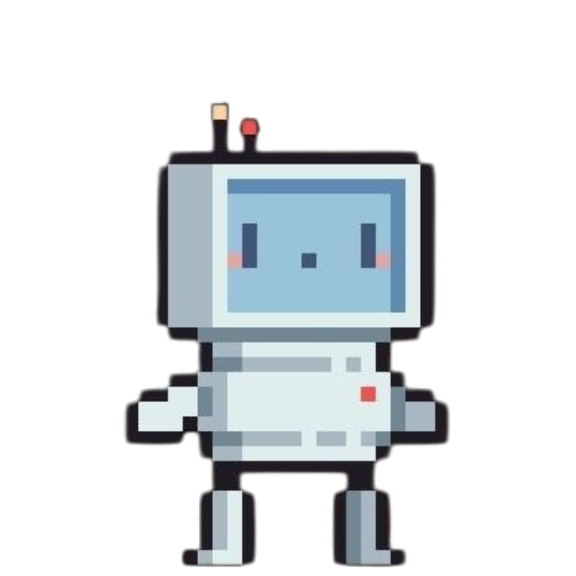

<h1>Hi, I'm Shreya  </h1>

  
  Welcome to my little corner of GitHub &lt;3

 

  

 

 

 

This is a space where I explore ideas, build things that spark my curiosity, and share pieces of my journey as a developer. Some days you'll find code, while other days you'll find design experiments or something new that caught my interest.

I'm a Computer Science student with a passion for AI and machine learning, data science, and software development. I love creating things that are both useful and enjoyable to interact with.

For me, coding is more than solving problems. It's a creative outlet. I enjoy combining technology with design to bring ideas to life and continuously learning how things work behind the scenes.

 

###  Currently Exploring

- Artificial Intelligence & Machine Learning
- Data Science & Analytics
- Full Stack Development
- Design & User Experience

 

  

 
