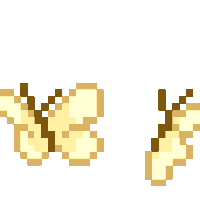
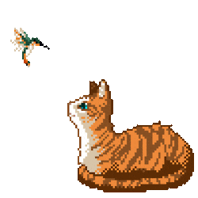

# Hi, I'm Shreya

Welcome to my little corner of GitHub <3

  

 

This is a space where I explore ideas, build things that spark my curiosity, and share pieces of my journey as a developer. Some days you'll find code, while other days you'll find design experiments or something new that caught my interest.

I'm a Computer Science student with a passion for AI and machine learning, data science, and software development. I love creating things that are both useful and enjoyable to interact with.

For me, coding is more than solving problems. It's a creative outlet. I enjoy combining technology with design to bring ideas to life and continuously learning how things work behind the scenes.

 

<table>
<tr>

<td width="45%" valign="top">

<h3>

 Currently Exploring
</h3>

<ul>
<li>Artificial Intelligence & Machine Learning</li>
<li>Data Science & Analytics</li>
<li>Full Stack Development</li>
<li>Design & User Experience</li>
</ul>

</td>

<td width="55%" align="center">

</td>

</tr>
</table>

 

  

